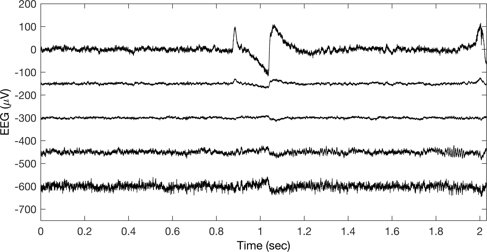
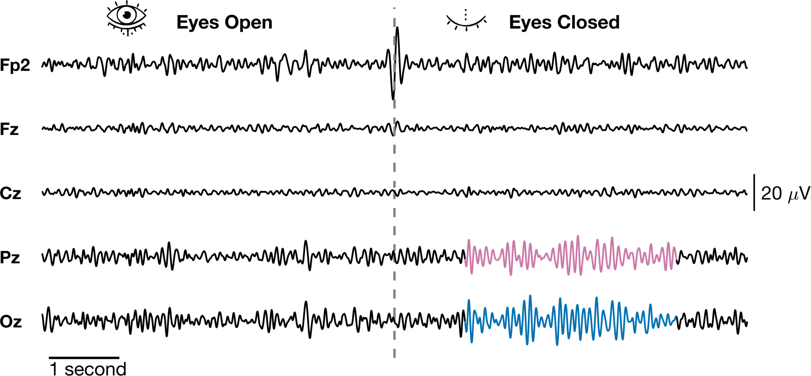

This is the `MATLAB` code for some basic figure making tutorials I wrote. They are focused around EEG data since that was my audience at the time. The are accompanied by a few [blog posts I wrote here](https://jabrantley.github.io/year-archive/). 

Download data and put in /data/ folder: https://www.dropbox.com/sh/xtlheuex5rk7whl/AABdveaLOTWPZ2Uxzlm4BBCIa?dl=0

The basic idea is how we take a default figure like this

   

 

and make it look like this:

   

 

We also try doing some cool things with how colors impact our perception of the data and how we can animate if we need to. 

   

 

